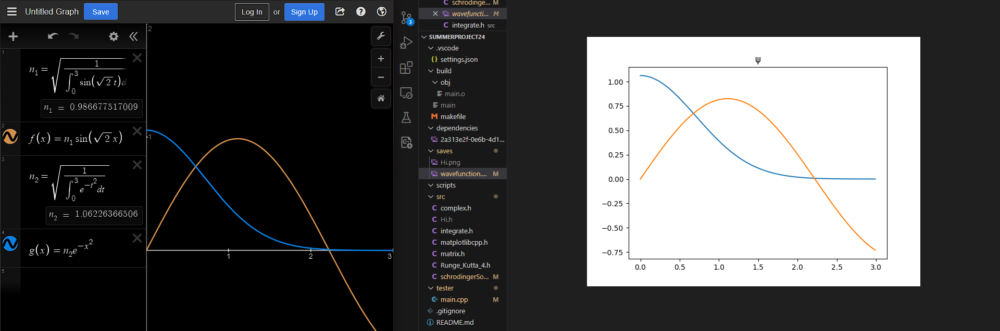
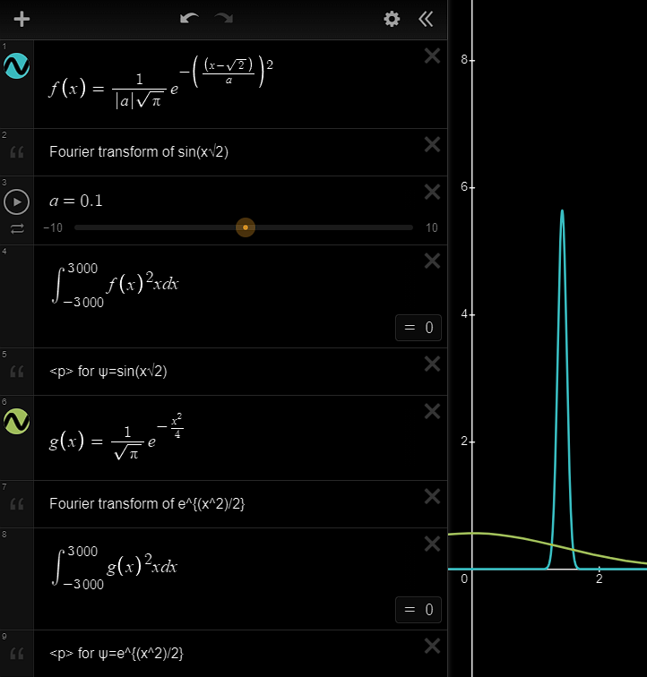
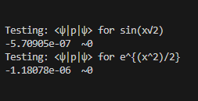

There were too many braincells lost on this project.
Written by Aryan*

<h1>QuLib</h1>
<h3>A C++ Quantum Mechanics Library</h3>

<h2>1. Introduction and Features</h2>
The main purpose of this library is to provide methods for physicists to numerically approach elementary quantum mechanics in a manner that is accurate, user-friendly, and of utmost importance, <strong>efficient</strong>.
<ul>
    <li>Schrodinger's equation solver using 4th order Runge Kutta methods for paired ordinary differential equations</li>
    <li>Expectation value computations</li>
    <li>Mathematical elements: linear algebra and complex number implementations</li>
</ul>

<h2>2. Schrodinger's equation solver</h2>
Background:
Schrodinger's equation (whose time-independent part I am refering to, of course) is a second-order partial differential equation that describes the properties (states) of a quantum particle.

```math
-\frac{\hbar^2}{2\mu}\nabla^2 \psi(\vec{r}) + V(\vec{r})\psi(\vec{r}) = E\psi(\vec{r})
```
There exist, however, very few cases in which this equation is analytically solvable. The rest have to be solved numerically. To achieve this task, I implemented the Runge Kutta method, which can solve first order, linear, ordinary differential equations. It is defined as follows:
```math
y_{n+1}=y_n + h \sum_{i=1}^s b_i k_i \ \ : \ \ k_i \equiv \frac{dy}{dx}(x_n + c_i h, y_n + h \sum_{j = 1}^s a_{ij} k_j)
```
The Runge Kutta method is found to be extremely efficient when expanded to the 4th order:
```math
y_{n+1} = y_n + \frac{h}{6}(k_1 + 2k_2 + 2k_3 + k_4)
```
```math
x_{n+1}=x_n + h
```
```math
k_1 = \frac{dy}{dx}(x_n, y_n)
```
```math
k_2 = \frac{dy}{dx}(x_n + \frac{h}{2}, y_n + h\frac{k_1}{2})
```
```math
k_3 = \frac{dy}{dx}(x_n + \frac{h}{2}, y_n + h\frac{k_2}{2})
```
```math
k_1 = \frac{dy}{dx}(x_n+h, y_n+hk_3)
```
But we have a second order differential equation, so how can we apply the Runge Kutta method to it? The key is that we can split a second order differential equation into a system of first-order differential equations. Specifically, if we restrict ourselves to 1 dimension:

```math
-\frac{\hbar^2}{2\mu} \frac{\partial^2}{\partial x^2} \psi(x) + V(x)\psi(x) = E\psi(x)
```
Let us now define the first derivative of $`\psi`$ as $`\frac{\partial \psi}{\partial x} = \psi'`$ and use it to define the system of (now <strong>first order</strong>) differential equations:
```math
-\frac{\hbar^2}{2\mu} \frac{\partial \psi'}{\partial x} + V(x)\psi(x) = E\psi(x)
```
```math
\frac{\partial \psi}{\partial x} = \psi'
```
If we now get rid of the stupid human constants (shoutout to Dr. B. C. Regan) by setting $`\hbar = \mu = E = 1`$ and simplifying:
```math
\boxed{\frac{\partial \psi'}{\partial x} = 2\psi(x) (V(x) - E)}
```
```math
\frac{\partial \psi}{\partial x} = \psi'
```
We now apply Runge Kutta methods to this to solve for $`\psi(x)`$.

<h2>3. Expectation value computations</h2>

Thus far, the only expectation values supported by this library are $`\langle \hat{x} \rangle`$, $`\langle \hat{p} \rangle`$.

The computation of $`\langle \hat{x} \rangle`$ is trivial, as we simply need to compute the integral:

```math
\langle \hat{x} \rangle = \langle \psi | \hat{x} | \psi \rangle = \int_{\mathbb{R}}dx \psi^*(x) \ \ x \ \ \psi(x)
```
The computation of $`\langle p \rangle`$, however, is much less trivial. While I considered using the definition of the momentum operator in position space, $`[\ \hat{p}\ ]_{pos} \equiv -i\hbar \nabla`$, I decided to use an alternative approach: viewing $`\langle p | \psi \rangle`$ as the fourier transform of $`\langle x | \psi \rangle`$:

```math
\langle p | \psi \rangle = \psi(p)
```
```math
\langle \psi | \hat{p} | \psi \rangle = \langle \hat{p} \rangle = \int_{\mathbb{K}} dp \ \langle \psi | p \rangle \ \ [\ \hat{p}\ ]_{momentum} \ \ \langle p | \psi \rangle
```
```math
\langle p | \psi \rangle = \int \langle x | \psi \rangle e^{-ipx/\hbar}dx
```
```math
\langle \hat{p} \rangle = \int dp \ \ (\int \langle \psi | x \rangle e^{ipx/\hbar}dx) \ \ p \ \ (\int \langle x | \psi \rangle e^{-ipx/\hbar}dx)
```

<h2>4. Mathematical tools</h2>
The mathematical tools introduced in this library include:
<strong>Integration tools</strong>
<ul>
    <li>
    <code>double integrate(integrand fxn, double x0, double xEnd, double h)</code> : returns the approximate value of an integral of fxn with lower bound x0 and upper bound xEnd, with spacing h
    <li>
    <code>double integrateOverAllSpace(integrand fxn, double h)</code> : returns the value of the integral over all real numbers of fxn, computed with spacing h
    </li>
    <li>
    <code>double integrateOverAllKnownValues(std::vector<double> knownValues, double sep)</code> : returns the value of the integral over known values of a function, with spacing sep
    </li>
</ul>

<h2>5. Testing</h2>
This code was extensively tested against programs that are known to work. For example, below is a side-by-side comparison of Desmos and the graphs produced by this code.



Tests I ran on the $`\langle p \rangle`$ of particle-in-a-box and quantum-harmonic-oscillator problems (two analytically solvable setups) were in agreeance with calculations ran on Desmos:




<hr>
Footnotes:

*(That is, everything except for the graphing library, "matplotlibcpp.h". That was cloned from https://github.com/lava/matplotlib-cpp.git)